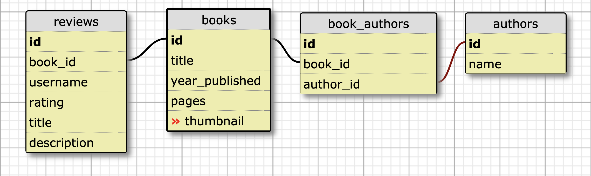
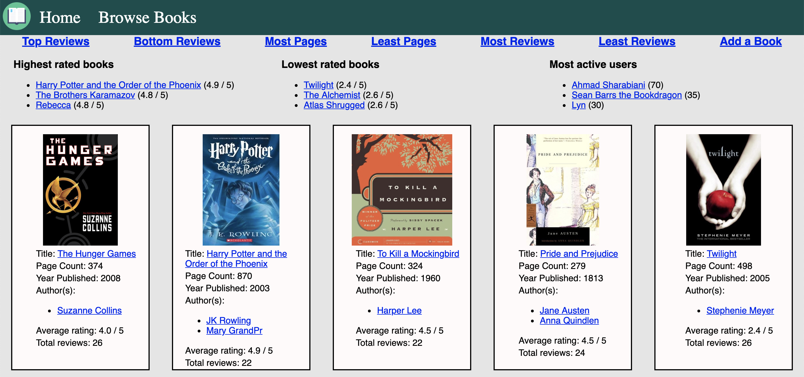

# Book Club

This is a student project from the Turing School of Software & Design as part of the Module 2 backend engineering curriculum.  The purpose of this project was to build an application with Ruby on Rails that allows users to browse and review books.  It is seeded with data for presentation purposes, however, it is fully functioning to add or remove books and book reviews.  

It tested our abilities to setup a database with many-to-many relationships and implement CRUD functionality.  The project was completed utilizing test-driven development and organized with a MVC structure.

- View it live [here](https://book-club-reviews.herokuapp.com/)  
- View the original assignment [here](https://github.com/turingschool-projects/BookClub)
- Team members: [Matt Levy](https://github.com/milevy1) & [Vincent Provenzano](https://github.com/Vjp888/)

## Built With

* [Ruby on Rails 5.1.6](https://rubyonrails.org/) - Web Framework
* [PostgreSQL](https://postgresapp.com/) - Database Management System

### Database Schema


### Screenshot of Books index page


### Installing

These instructions will get you a copy of the project up and running on your local machine for development and testing purposes.

- From your terminal, clone the repo: ```git clone git@github.com:Vjp888/book_club.git```
- If you do not have PostgreSQL, follow the steps to setup PostgreSQL [here](https://postgresapp.com/)
- Move to the new project directory: ```cd book_club```
- Install required gems by running: ```bundle install```
- Seed the application with data by running: ```rake db:{drop,create,migrate,seed}```
- Start up your local Rails server by running: ```rails server```
- View the application in your browser

### Testing

RSpec was used for testing with gems Capybara and Shoulda-matchers.  Test coverage was tracked with SimpleCov.

- To run tests, from the root directory, run: ```rspec```

### Break down of tests

Tests in the spec/features folder test features simulating user interaction with the application and then expecting content on the page within specific CSS selectors.

```ruby
# spec/features/new_review_spec.rb
RSpec.describe 'Adding new review to book', type: :feature do
  context 'as a visitor to a book show page' do
    it 'shows a link to add a new review to the book' do
      book_1 = Book.create(thumbnail: 'steve.jpg', title: 'where the wild things are', pages: 40, year_published: 1987)
      visit book_path(book_1)

      within ".reviews" do
        expect(page).to have_link('Add review', href: new_book_review_path(book_1))
      end
    end
  end
end
```

Tests in the spec/models folder test the object models setup in the database.  They contain validations for table attributes, table relationships, and also methods built with ActiveRecord to interact with the database.

```ruby
# spec/models/book_spec.rb

RSpec.describe Book, type: :model do
  describe 'Validations' do
    it { should validate_presence_of :thumbnail }
    it { should validate_presence_of :title }
    it { should validate_presence_of :pages }
    it { should validate_presence_of :year_published }

    it { should validate_numericality_of(:pages).only_integer }
    it { should validate_numericality_of(:year_published).only_integer }
  end

  describe 'Relationships' do
    it { should have_many :book_authors }
    it { should have_many(:authors).through(:book_authors) }
    it { should have_many :reviews }
  end

  describe 'Instance methods' do
    describe 'review ratings and counts' do
      before(:each) do
        @book_1 = Book.create(thumbnail: 'steve.jpg', title: 'where the wild things are', pages: 40, year_published: 1987)
        @book_2 = Book.create(thumbnail: 'steve.jpg', title: 'Book 2 title', pages: 40, year_published: 1987)
        @book_1.reviews.create(rating: 5, title: 'Review_1_title', description: 'Review_1_description', username: 'Review_1_username')
        @book_1.reviews.create(rating: 4, title: 'Review_2_title', description: 'Review_2_description', username: 'Review_2_username')
      end

      context '.average_rating' do
        it 'returns the average rating of all reviews for the book' do
          expect(@book_1.average_rating).to eq(4.5)
        end

        it 'returns 0 if there are no reviews for the book' do
          expect(@book_2.average_rating).to eq(0)
        end
      end
    end
  end
end
```
